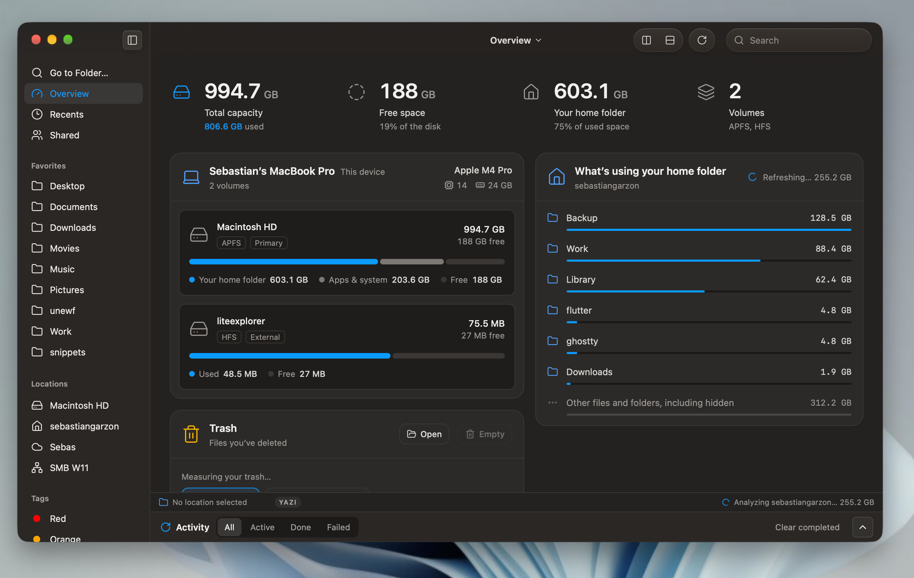

<div align="center">


# Lite Explorer

### Un explorador de archivos tranquilo y con sensación nativa para tu escritorio.

Hecho con Tauri, SvelteKit y TypeScript.

[English](README.md) · **Español**



</div>

## Menos adornos. Más espacio para tus archivos.

Lite Explorer es un explorador de archivos de escritorio experimental con un
diseño familiar inspirado en macOS: navegación rápida, una barra de
herramientas enfocada y un área de contenido amplia.

## Lo destacado

### Paleta de comandos

Presiona <kbd>⌘</kbd> <kbd>⇧</kbd> <kbd>P</kbd> y escribe. Un solo campo de
búsqueda encuentra comandos, carpetas por ruta, accesos rápidos, favoritos,
ubicaciones y carpetas recientes, así casi no necesitas el mouse.

### Portapapeles de transferencias y panel de Actividad

Copia (<kbd>⌘</kbd> <kbd>C</kbd>) o corta (<kbd>⌘</kbd> <kbd>X</kbd>) archivos
al portapapeles de transferencias y pégalos (<kbd>⌘</kbd> <kbd>V</kbd>) donde
vayas después. Cada tarea larga aparece en el panel de Actividad: copias,
movimientos, eliminaciones, extracción y compresión de archivos, subidas y
descargas. Filtra las tareas por **All**, **Active**, **Done** o **Failed** y
sigue su progreso sin bloquear la ventana.

### Vista general

Mira tu disco de un vistazo: capacidad total, espacio libre, volúmenes
montados, qué ocupa tu carpeta personal y tu Papelera.

### Y más

- Pestañas y un segundo panel para navegar lado a lado
- Vista previa integrada para código, Markdown, CSV, PDF e imágenes
- Atajos de teclado estándar o estilo yazi
- Barra lateral plegable y redimensionable con favoritos, ubicaciones y etiquetas
- Interfaz oscura, pensada para el teclado

<div align="center">


</div>

## Instalar en macOS

Descarga el DMG universal del último release, ábrelo y arrastra Lite Explorer a
la carpeta Aplicaciones.

Las builds actuales usan un certificado autofirmado y Apple no las notariza. Si
macOS bloquea el DMG, haz Control-clic sobre él en Finder, elige **Abrir** y
luego **Abrir** otra vez. También puedes quitarle el atributo de cuarentena en
Terminal:

```bash
xattr -dr com.apple.quarantine "/ruta/a/liteexplorer_0.1.5_universal.dmg"
```

## Desarrollo

```bash
cd apps/desktop

# Ver las recetas de just disponibles
just

# Instalar dependencias
just install

# Ejecutar el servidor de desarrollo
just dev
```

## Stack

Tauri 2 · SvelteKit · TypeScript

## Origen

Lite Explorer es una extracción de varias herramientas que hice antes:

- Una interfaz para conectarme a **S3** y **SMB**. Proyectos como
  [Nicebucket](https://github.com/nicebucket-org/nicebucket) no guardaban las
  conexiones que hacías, así que había que volver a escribirlas cada vez. Esa
  fue la motivación original para guardar y reutilizar conexiones aquí.
- Un cliente **SFTP**, que se convirtió en la base del explorador de archivos.
- Un par de herramientas internas que uso en el backoffice de mi trabajo.

Así que esto no fue "vibe-coded". Usé IA para copiar código existente de esos
proyectos anteriores hacia este — lo cual, hasta ese momento, quizá se describe
mejor como *vibe-copied*.

La interfaz de usuario se inspira en el **Finder** de macOS y en
[Spacedrive](https://github.com/spacedriveapp/spacedrive).

## Licencia

[MIT](LICENSE) © 2026 Litepod Studio
