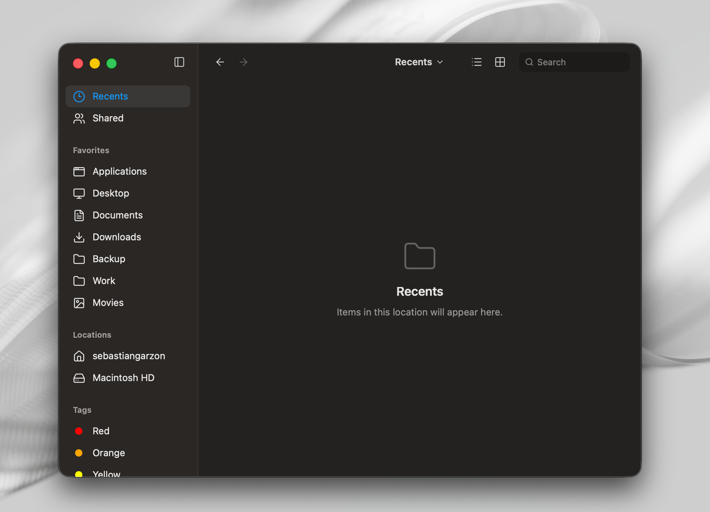

<div align="center">

# Lite Explorer

### A calm, native-feeling file explorer for your desktop.

Built with Tauri, SvelteKit, and TypeScript.



</div>

## Less chrome. More room for your files.

Lite Explorer is an experimental desktop file-browser interface with a familiar
macOS-inspired layout: quick navigation, a focused toolbar, and a roomy content
area.

- Collapsible, resizable sidebar
- Floating-sidebar preference that persists locally
- Dark, keyboard-friendly interface

## Development

```bash
cd apps/desktop
npm install
npm run tauri dev
```

## Stack

Tauri 2 · SvelteKit · TypeScript
